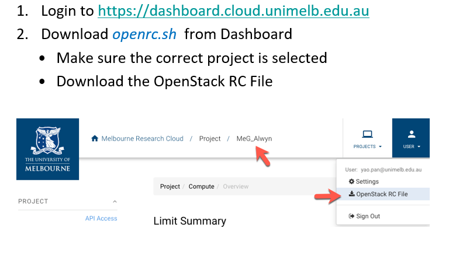
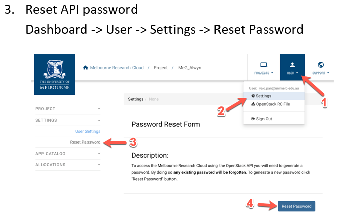

# Ansible
## How to run
1. Get your Openstack Password
    - 
    - 

2. Deploy instances on the Nectar
    - <table>
        <tr>
            <th>Hosts</th>
            <th>role</th>
            <th>description</th>
        </tr>
        <tr>
            <td rowspan="5">localhost</td>
            <td>common</td>
            <td>Install Python-pip, openstacksdk and update pip on hosts</td>
        </tr>
        <tr>
            <td>show-images</td>
            <td>Show all available Openstack images</td>
        </tr>
        <tr>
            <td>create-volumes</td>
            <td>Create volumes from vars</td>
        </tr>
        <tr>
            <td>create-security-groups</td>
            <td>Create security groups and their rules</td>
        </tr>
        <tr>
            <td>create-instances</td>
            <td>Create instances on NeCTAR<br>Add hosts to Ansible in-memory inventory and a file for hosts ip to inventory/wm_inventory_file</td>
        </tr>
        </table>
    - ```./deploy_instances_debug.sh```  
    - ```./deploy_instances.sh```
3. generate instance to be created  
    ```cd host_vars```  
    ```python generate-instances.py -n <n instances you would like to be created>```  
    - E.g.:   
        windows: ```python generate-instances.py -n 4```  
        ubuntu: ```python3 generate-instances.py -n 4```  
    generated instances setup will be stored in ```host_vars/instances.yaml```
4. Configure instances environments on the Nectar
    - <table>
          <tr>
            <th>Hosts</th>
            <th>role</th>
            <th>description</th>
          </tr>
          <tr>
            <td><span style="font-weight:normal">localhost</span></td>
            <td><span style="font-weight:normal">add-NectarGroupKey</span><br></td>
            <td><span style="font-weight:normal">copy /config/NectarGroupKey to ~/.ssh/</span><span style="font-weight:400;font-style:normal">NectarGroupKey</span><br></td>
          </tr>
          <tr>
            <td rowspan="5">instances</td>
            <td>add-proxy</td>
            <td>Add proxy in /etc/environment<br/>Reboot the instance</td>
          </tr>
          <tr>
            <td>install-dependencies</td>
            <td>sudo apt-get update; sudo apt-get install [...]<br>pip3 install [...]</td>
          </tr>
          <tr>
            <td>setup-docker</td>
            <td>Install docker as well as setting up http proxy for docker</td>
          </tr>
          <tr>
            <td><span style="font-weight:normal">git-clone-source-repository</span><br></td>
            <td>configure git ssh key<br>clone the source code repository to the instances</td>
          </tr>
          <tr>
            <td>mount-volumes<br></td>
            <td>mount the volumes for each instances</td>
          </tr>
        </table>
    - No matter what OS you are, you should create a file: ```/config/GitHubKey.pem``` with **your GitHub private key**
    - ```./configure_instances_debug.sh```
5. generate hosts for applications  
    ```cd inventory```  
    ```python generate-host.py -c <n hosts for the crawler> -b <n hosts for the backend server>```
    - E.g.:  
        windows: ```python generate-host.py -c 1 -b 1```  
        ubuntu: ```python3 generate-instances.py -c 1 -b 1```  
    generated application host setup will be stored in ```inventory/application_hosts.yaml```
4. Deploy Applications on the Nectar instances
    - <table>
        <tr>
            <th>Hosts</th>
            <th>role</th>
            <th>description</th>
        </tr>
        <tr>
            <td>instances</td>
            <td><span style="font-weight:normal">git-pull-source-repository</span><br></td>
            <td>Update the repository on the instances</td>
        </tr>
        <tr>
            <td><span style="font-weight:normal">crawler</span></td>
            <td>deploy-crawler<br></td>
            <td>deploy crawler application</td>
        </tr>
        <tr>
            <td>backend</td>
            <td>deploy-backend-server</td>
            <td>deploy backend server application</td>
        </tr>
        </table>
    - crawler: ```./deploy_crawler.sh```
    - backend: ```./deploy_backend.sh```
5. Remove instances on the Nectar
    - ```./remove_deploy_instances.sh```

## Notes
1. initialize a role
    - ```cd roles```
    - ```ansible-galaxy init test-role-1```
2. use https://www.tablesgenerator.com/html_tables to modify the tables above
